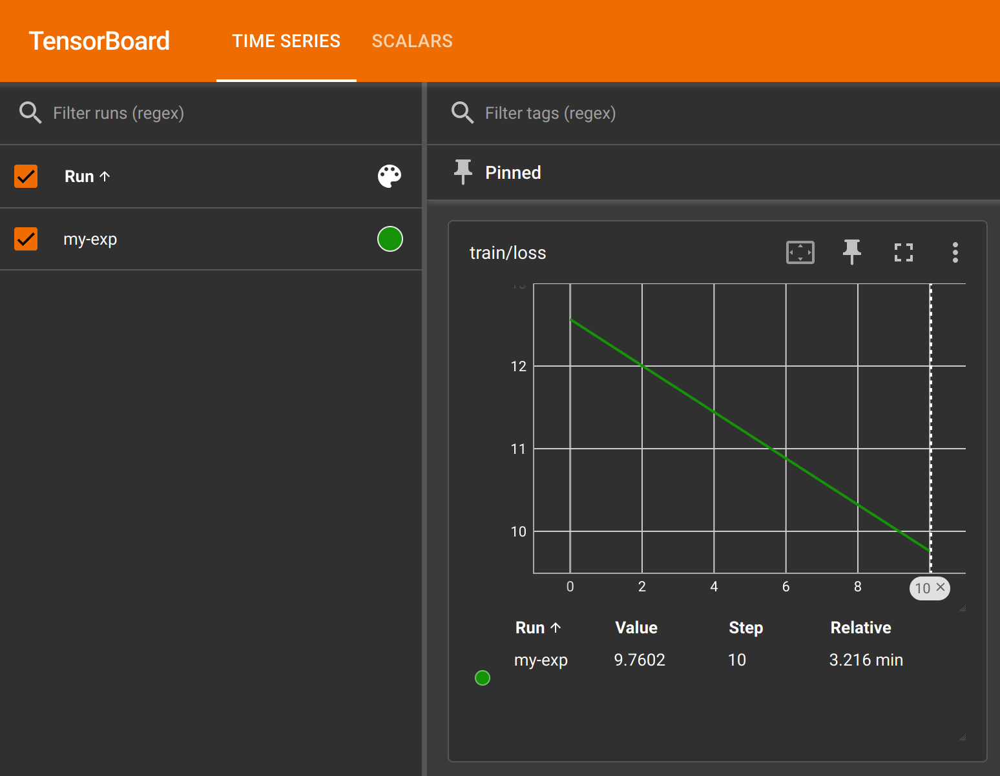

# How to view metrics on tensorboard

The `torch_xla_models/train.py` trainer writes tensorboard metrics for each
experiment under `${output_dir}/runs`, where `output_dir` comes from the Hydra
config.

You may customize the name of the experiment by setting the `run_name` option.
If left unspecified, the run name defaults to the current date and time.

You may also turn up the metrics logging frequency by reducing `logging_steps`.

Example:

```sh
torchprime/torch_xla_models/train.py run_name=my-exp logging_steps=1
```

The metrics contains `loss` and `learning_rate` etc. and you can visualize their
progression by starting a tensorboard web server:

```sh
tensorboard --logdir outputs/runs
```

If you're starting tensorboard on a remote VM, you may use VSCode or SSH to
forward its HTTP port (typically `6006`) to your local machine, and then open
the prompted link on your browser. You should expect to see something like this:


