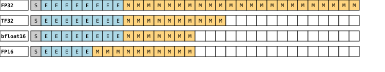

# TPU vs. GPU: Accuracy Equivalence Despite the Precision Difference

This `README.md` compares the numerical results of training a ResNet-18 model on
TPU and GPU. 

## Understanding Numerical Differences: TPU vs. GPU

If you perform the exact same mathematical computation on different hardware
accelerators, will the result be identical? For deep learning workloads, the
answer is often no. Modern deep learning accelerators like Google's Tensor
Processing Units (TPUs) and NVIDIA's Graphics Processing Units (GPUs) uses
different floating-point precision levels to maximize computational speed.

Consider how even a simple computation can vary across hardware due to their
distinct floating-point precision levels:

* A standard CPU operation, or full-precision mode on a GPU, typically uses
  `float32`, which retains the full 23 bits of mantissa precision.

* An **NVIDIA GPU** (e.g., A100 and later) utilizes `TensorFloat-32` (TF32)
  within its Tensor Cores. While it accepts `float32` inputs, TF32 effectively
  processes them with an 8-bit exponent and a 10-bit mantissa internally.

* A **Google TPU** leverages `bfloat16`. This 16-bit format is specifically
  designed with an 8-bit exponent (matching `float32`'s range) but reduces the
  mantissa (precision) to only 7 bits.

This difference in representation is why floating-point computations can yield
slightly different results on a GPU versus a TPU. Deep learning model training
involves extensive calculations where these small numerical differences
accumulate across hardware platforms. This makes direct, bit-for-bit comparison
of final model states (weights, gradients, or loss) between different systems,
like TPUs and GPUs, impractical and potentially misleading.

However, deep learning models are remarkably robust. Even with these
computational variances, models trained on both TPUs and GPUs can converge to
nearly equivalent final model accuracy. For more details on floating-point
precision, refer to this
[article](https://cloud.google.com/blog/products/ai-machine-learning/bfloat16-the-secret-to-high-performance-on-cloud-tpus)
and this
[tutorial](https://github.com/pytorch/xla/blob/9c8ae9f9d79770a0f534e7eccf5b48c087d7513f/docs/source/tutorials/precision_tutorial.ipynb).

## Experimental Setup

### Model and Dataset

To provide a clear and focused comparison, we use the well-established
**ResNet-18** model. For the dataset, we use a combination of **VGGFace** and
**FaceID 550**. The data loading logic, detailed in `data.py`, creates a
deterministic 90/10 stratified split for training and testing, ensuring that
images for every identity are present in both sets.

### Methodology

Our methodology is designed to provide a comprehensive comparison by evaluating
two key aspects: the impact of **training techniques** and the numerical
differences between **hardware platforms**.

#### Training Approaches

The `train.py` script contains the core logic for our experiments. It defines
two distinct training functions to illustrate the impact of different training
strategies:

-   **`train_simple`**: This function uses a basic setup with a standard SGD
    optimizer and a fixed learning rate. It is used to demonstrate how sensitive
    training can be to hyperparameters, like a high learning rate.

-   **`train_prod`**: This function implements a more robust, production-like
    training approach, incorporating the AdamW optimizer, a learning rate
    scheduler, and backbone freezing.

By comparing these two approaches, our analysis in `viz.ipynb` highlights the
significant impact that production-level training techniques have on model
performance and stability.

#### Hardware Comparison and Statistical Analysis

To ensure a fair and robust comparison between TPU and GPU platforms, we follow
a rigorous process:

1.  **Multiple Runs**: We recognize that a single training run can be misleading
    due to random factors like weight initialization and data shuffling.
    Therefore, we execute the training process multiple times on both TPU and
    GPU platforms. This provides a distribution of results for each hardware
    type, allowing for a more reliable comparison than one based on a single
    run.

2.  **Learning Rate Selection**: Model performance is highly dependent on the
    choice of hyperparameters, particularly the learning rate. A learning rate
    that is optimal for one hardware platform may cause training to diverge on
    another. As detailed in our analysis notebook (`viz.ipynb`), we carefully
    selected a learning rate that ensures stable convergence on both TPU and
    GPU.

3.  **Statistical Analysis (t-test)**: A t-test is a statistical tool used to
    determine if there is a significant difference between the average results
    of two groups. We use an independent two-sample t-test to compare the final
    model accuracies from our multiple TPU and GPU runs. This is crucial because
    a single training run can be misleading due to random noise. The t-test
    allows us to confidently conclude whether the observed performance
    difference is real or just a product of chance.

### Results and Analysis

A detailed breakdown of the results, including visualizations of the accuracy
distributions and the full t-test calculations, is available in our analysis
notebook:

- [View Results Analysis](viz.ipynb)

The raw data and logs used for this analysis can be found in the following
files:
- [metrics.csv](./metrics.csv)
- [gpu-prod.log](./gpu-prod.log)
- [tpu-prod.log](./tpu-prod.log)
