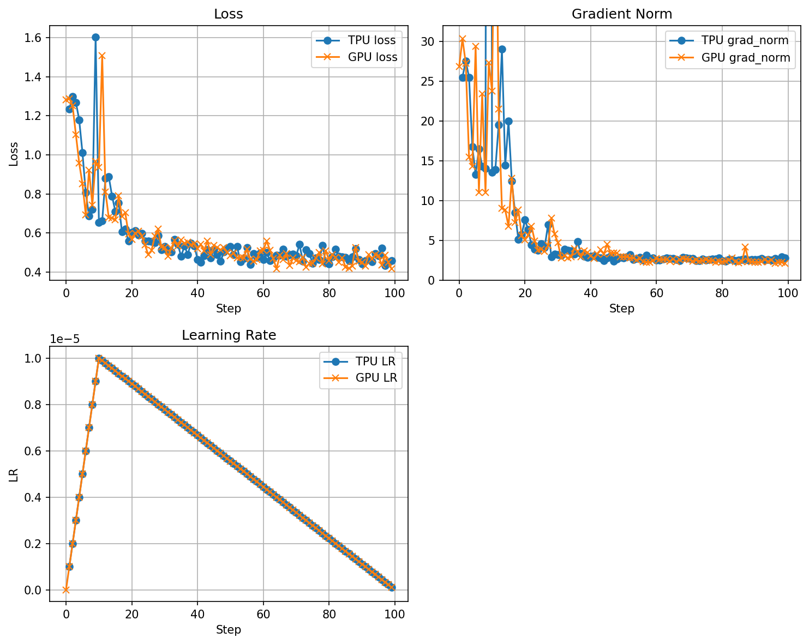

### GPU run with transformers
setup env with GCP GPU vm and run
```
torchrun --nproc_per_node=4 torchprime/personal/jialei/gpu-scripts/run-sft-gsm8k.py
```

### TPU run with torchprime
setup env with GCP TPU vm and run
```
clear; python torchprime/torch_xla_models/train.py    --config-name llama-3-8b-sft-w-gsm8k task.convert_to_safetensors=False task.export_checkpoint_path=null  task.max_steps=100 task.optimizer.learning_rate=1.e-5   ici_mesh.fsdp=4     dcn_mesh.data=1  logging_steps=1
```

### Compare the training metrics
update metrics to files `data_hf.txt` and `data_tp.txt` and then run 
```
python torchprime/personal/jialei/gpu-scripts/draw_figure.py
```
And you will get a figure like this:

